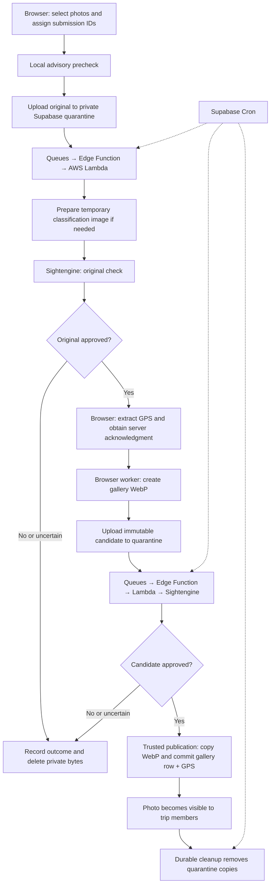

# Quarantine and moderate photo submissions before optimization and publication

Date: 2026-09-29

Status: Accepted design; implementation code present, release validation and deployment pending. See the [deployment runbook](../photo-upload-runbook.md) for checks and current blockers.

## Context

Traveled is initially used by its owner and three friends to document their travels. Photos are primarily viewed in the gallery and on the map. Uploads should handle selections of up to 100 photos, remain responsive on phones, continue across app navigation, recover from temporary failures, and prevent photos depicting nudity or sexual activity from being shared.

This is a side project. The upload design must not require a Supabase Pro subscription. Browser processing keeps gallery optimization on users' devices. Sightengine's free plan provides authoritative moderation, with AWS Lambda handling provider-compatible classification preparation. Pause when the provider's free quota is exhausted; do not automatically upgrade to paid usage. AWS compute and other service usage remain subject to their account allowances and pricing.

The current implementation uploads original files sequentially, stops on the first failure, and creates a new Storage path on each invocation. It has no moderation gate. Although the existing `trip-photos` bucket is private, its access policies allow group members to read uploaded objects before gallery metadata exists. A private bucket alone therefore does not establish a moderation boundary.

## Services and responsibilities

| Service/runtime | Responsibility |
|---|---|
| Browser workers | Local advisory precheck, GPS extraction, and optimization of approved sources into gallery WebP images |
| Supabase Auth and RLS | Authenticate uploaders and enforce trip membership, quarantine isolation, and recovery access |
| Supabase Storage | Hold immutable originals and candidates in a private quarantine bucket and published WebP images in `trip-photos` |
| Supabase Postgres | Store submission identity, GPS, stage and outcome, retry state, capacity reservations, and gallery metadata |
| Supabase Queues | Deliver durable moderation, publication, and cleanup jobs |
| Supabase Cron | Recover interrupted work, dispatch retries, enforce expiry, and sweep late objects |
| Supabase Edge Functions | Authorize operations, orchestrate jobs, invoke Lambda, and finalize publication |
| AWS Lambda | Read authorized stored images, prepare temporary classification images when required, and call Sightengine |
| AWS IAM, SAM/CloudFormation, CloudWatch, and Secrets Manager | Restrict Lambda invocation, deploy the function, retain operational logs, and resolve existing deployment credentials; these support Lambda rather than processing gallery images |
| Sightengine | Authoritative original and candidate classification using `nudity-2.1` |

**AWS Lambda is the selected AWS service.** Only trusted server code may invoke it through IAM authorization. Invoke synchronously with a small server-owned Storage reference and expected object identity/digest, rather than embedding image bytes in the invocation. Lambda reads authorized stored bytes and returns a classification bound to those bytes. It does not accept arbitrary client URLs or client moderation verdicts. Check both invocation errors and the classification payload; an HTTP success alone is not approval.

Lambda prepares a temporary metadata-free classification JPEG only when provider compatibility or input limits require it. Discard it after checking; do not persist or publish it. Browser workers produce the published WebP. Provider-account quotas and AWS deployment configuration must be verified before release.

## End-to-end flow



The decision branches represent successful classification responses. Technical failures retry or pause; they never authorize publication. A local warning cannot approve or permanently reject a submission. Browser optimization requires an open browser; after candidate transfer, final verification and publication can finish while it is closed.

Gallery visibility requires committed gallery metadata and current trip membership. Cancellation and publication serialize against the same submission. Submission IDs remain stable throughout; regenerated candidates receive new immutable generations, and retired generations cannot publish.

## Decisions and rationale

### Independent browser worker pools

Use two processing workers (pWorkers) and three concurrent upload slots (uWorkers) on desktop and tablet. On phones, use one pWorker and two uWorkers. These pools belong to the active scheduler for the signed-in user across tabs of the same browser. Each available slot takes the next eligible photo immediately; there is no barrier requiring a group of three uploads to finish together.

Separate pools let processing and network transfer overlap. Lower mobile concurrency limits simultaneous image decoding and network activity. These are initial limits to validate on the group's devices, not globally shared server worker counts.

Optimization may start only after authoritative server moderation approves the source image. The server receives the original rather than an optimized WebP. Browser pWorkers are the selected processing location. The browser then transfers the optimized candidate to quarantine for a final server content check before publication. Browser optimization pauses when the browser is closed and resumes from an approved server source after reopening.

Allow at most 100 unfinished photo submissions in the browser queue, across repeated selections and tabs. Use Web Locks for exclusive scheduler ownership and BroadcastChannel for queue updates and coordination. Persist account-scoped submission metadata in IndexedDB, without image bytes. A tab taking ownership first reconciles server state before resuming work. Terminal outcomes and exhausted technical failures free active queue capacity but remain visible; manual retry of a technical failure must acquire capacity again.

Bound the candidate buffer to three candidates and 24 MiB on desktop/tablet, or two candidates and 16 MiB on phones, including active transfers and candidates retained for retry. Reserve an 8 MiB candidate slot before processing and cap each encoded candidate at 8 MiB. A candidate exceeding the cap produces a visible processing failure rather than silently changing the accepted quality settings. Stop scheduling processing when the buffer lacks capacity; release worker slots during retry delays.

Reserve server Storage capacity before admitting an original, including room for its candidate and the published copy. Use a default 800 MiB project budget accounting for existing objects across the project and outstanding reservations without counting the same allocated bytes twice. Pause admission when capacity is unavailable; reconcile usage and release reservations as transfers and cleanup complete. This budget is an application limit, not a claimed provider allowance.

### Optimize for viewing, including HEIC inputs

Support still HEIC images as inputs alongside JPEG, PNG, and still WebP, up to 20 MiB and 50 megapixels. Validate the actual format and dimensions rather than relying only on extensions or client MIME types. Users can select original supported phone photos; they do not need to convert files themselves. WebP is the pipeline's optimized output format, not a requirement for the phone's camera format. Use a maximum long edge of 2,560 pixels, preserve aspect ratio and orientation, never upscale, and encode WebP at quality 0.8. Extract GPS before stripping embedded metadata so photo locations remain available on the map.

These settings favor gallery quality, lower transfer volume, and lower Storage usage over preserving originals for printing. Validate visual quality and actual encoded size during implementation. Use libheif-js/WASM for browser HEIC decoding. Reject multi-photo HEIC files containing multiple top-level photos; auxiliary thumbnails and depth images do not count as additional photos. Reject videos, GIFs, animated PNG/WebP, and HEIC image sequences rather than converting animation into still frames. Motion from Live Photos is out of scope.

#### Persist GPS under the photo submission ID

Assign the stable unique submission ID before the first transfer and retain it through original upload, optimization, candidate upload, retries, and publication. Extract GPS from the original image and save the coordinates durably on the server with that ID, scoped to the authenticated uploader and trip, before optimization strips the metadata. The server must acknowledge this metadata handoff before the optimized candidate is considered ready for final verification and publication. Saving coordinates is idempotent under the submission ID; a failed save retries the same submission rather than creating another photo.

Validate latitude and longitude as a complete finite pair within their geographic ranges. If GPS is missing or cannot be extracted, explicitly record both coordinates as absent; this must not block an otherwise valid photo. Distinguish a completed extraction with absent GPS from a metadata handoff that has not completed yet.

Publication populates the gallery entry's coordinates from the saved submission metadata. Recovery reads that same server record rather than relying on browser memory, GPS embedded in the optimized WebP, or an original that may already have been cleaned up. This preserves map locations if the browser closes after candidate transfer and allows unused original images to be removed safely after publication.

#### Server optimization alternative considered and declined

Trusted server processing could upload the original once, moderate its immutable bytes, optimize that same approved source into WebP, and publish the derivative without accepting replacement image bytes from the browser. It could finish processing while the browser is closed and avoid a second moderation check solely to defend against client substitution. This alternative was declined in favor of browser pWorkers and avoiding a required Supabase Pro subscription for the side project.

The accepted trade-offs are two image transfers for approved submissions, a final server content check on the browser-produced candidate, and browser availability for optimization. Original transfers are larger than precompressed transfers. A custom server optimizer would shift costs and operational work toward backend compute and data transfer; choosing browser processing does not eliminate Storage or moderation usage costs.

Supabase's hosted Edge Functions currently limit each request to 2 seconds of CPU and each worker to 256 MB of memory, and do not support Sharp/libvips. Background tasks do not remove those limits. A custom native image pipeline therefore needs a compatible worker runtime; lighter orchestration can remain in Edge Functions.

Supabase's built-in Storage transformations support HEIC input but require Pro or above. These transform a response at delivery time; storing a permanent optimized derivative would require an explicit trusted read-and-write step. This paid feature is excluded by the subscription constraint. AWS Lambda is selected for temporary classification preparation, not server generation of the gallery derivative.

### Separate quarantine and published Storage buckets

Use Supabase Storage for both stages, with a completely separate private quarantine bucket. The intended flow is:

1. Perform a client content precheck for early feedback.
2. Transfer the original image to quarantine with a uWorker.
3. Have the server moderate the actual quarantined source image.
4. Delete rejected images and notify the uploader. Admit only server-approved sources to optimization.
5. Extract GPS from the approved source and obtain acknowledgment of the server metadata handoff; then optimize it into WebP with a browser pWorker.
6. Transfer the optimized candidate to quarantine with a uWorker, using the same submission identity.
7. Have the server moderate the actual optimized candidate; delete rejected images and notify the uploader.
8. Publish the approved candidate into the gallery's separate bucket and create the gallery entry, including the saved GPS metadata, through a trusted server operation.
9. After the published object and gallery entry are confirmed, clean up the submission's original and optimized candidate copies in quarantine.

The ordering is deliberate: avoid spending optimization resources on an image that fails verification. Decoding an input for classification, including HEIC compatibility, may still be necessary before a verdict; this is distinct from resizing and encoding the final gallery image.

Only trusted server operations may publish. Quarantined photos are not available to other trip members. Approved-source recovery requires both ownership of the submission and current trip membership. Clients must not be able to replace source or candidate bytes during moderation or after approval; disallow overwrites and bind checks to the stored object identity and digest. Keep the original path immutable. Give each regenerated candidate a new immutable generation under the same submission ID, retiring prior generations so they cannot publish. Reconcile uncertain transfer outcomes before creating another generation. The existing direct-write route into `trip-photos` must be closed when the new pipeline is implemented.

Copy the approved candidate through trusted code before committing the gallery row. Storage reads require a matching committed gallery row and current trip membership, so the copy alone cannot expose an image. The metadata transaction locks the submission, rechecks the active generation, moderation approval, completed GPS handoff, current access, expiry, and cancellation, and uses the submission ID as the unique gallery photo ID. Record publication and enqueue cleanup durably in the same transaction. Reconcile a lost response against this state before attempting publication again. Existing gallery photos are grandfathered and are not retroactively moderated.

If cancellation, expiry, or access revocation wins after copying but before metadata commits, durable cleanup also removes that unpublished gallery copy. A publication interrupted at this boundary must reconcile the existing copy and submission state before retrying or cleaning up. Cleanup distinguishes unpublished copies from committed gallery objects so it cannot delete a successfully published photo.

The separate bucket makes the trust boundary explicit. Client checks are an advisory precheck intended to speed feedback, while the server is the authoritative decision maker. A client verdict cannot authorize publication or permanently reject a photo without the server decision. The server checks the exact stored image rather than trusting a client-supplied approval or an earlier check of a different file. Cold model load and actual client precheck performance still need measurement.

Browser pWorkers require transferring the original first and the optimized candidate later, using the same upload concurrency pool. Approval of the original cannot authorize arbitrary replacement bytes: a modified browser could substitute an explicit image after approval. The final server check is therefore required for the selected browser-processing design. The initial check still prevents optimization of originals that fail verification; the final check protects the publication boundary from a substituted candidate.

Release the uWorker after each confirmed transfer so later photos can upload while the server checks earlier photos. Show transferred-but-unapproved submissions as awaiting moderation rather than completed. Moderation before optimization reduces wasted processing on rejected sources, but original uploads, second transfers, and final output verification can increase bandwidth and time to gallery visibility.

### Clean up quarantine after successful publication

Keep the original while it is needed for browser optimization or recovery, and keep the optimized candidate until the approved published object and its gallery entry, including coordinates, are durably confirmed. Then remove both quarantine copies for that submission. Retain the published WebP and its gallery metadata. This avoids permanently storing full-size originals or duplicate optimized files while preserving recovery until publication succeeds.

Record durable cleanup work as part of finalization, identified by submission ID and trusted server-owned quarantine paths, so interruption after publication cannot silently leave unused objects behind. Cleanup is idempotent: an already-missing quarantine object counts as removed. Delete each remaining copy independently and persist progress so a partial cleanup can resume.

If deletion fails, leave the photo published, keep the remaining quarantine objects private, and schedule a delayed cleanup retry with backoff while releasing the worker. Cleanup must not repeat moderation, optimization, or publication, create another gallery entry, or delete the published object. Apply the same initial attempt plus four automatic retries to each cleanup cycle. After exhaustion, retain discoverable cleanup work, begin a new retry cycle daily, and support an explicit operator retry.

An upload authorized before cancellation or expiry may complete after cleanup. Cron sweeps for these late objects and enqueues cleanup again, even when a prior cleanup completed. Retain permanent minimal tombstones with enough trusted identity and path information to deny new uploads, quarantine/recovery reads, and repeated publication for terminal submissions. Successfully published gallery photos remain readable by authorized trip members. Preserve cleanup records if a trip is deleted; deleting the trip must not erase the information needed to remove its quarantine objects.

### Block nudity and sexual activity

Block nudity and sexual activity without exceptions in the initial version. Ordinary clothed and swimwear travel photos are allowed. Uncertain classifications stay withheld with an explanation. Moderation service failures are retryable, but do not permit publication without approval.

Use Sightengine `nudity-2.1` for authoritative checks of both the original and final candidate. Evaluate `nudity.sexual_activity`, `nudity.sexual_display`, and `nudity.erotica`; require every score to be finite and within [0, 1]. Approve only when all are below 0.20. A maximum score satisfying `0.20 <= maxScore < 0.80` is uncertain and produces a permanent rejection; `maxScore >= 0.80` rejects as detected prohibited content. Uncertainty is a content outcome, not a technical retry. Do not use general suggestiveness or swimwear scores to reject ordinary swimwear travel photos. This is an automated best-effort filter; perfect detection is not a requirement or a claim.

Load NSFWJS lazily for the advisory browser precheck. Show early feedback, but do not let its verdict authorize publication or permanently reject a photo. Model initialization or precheck failure must not prevent the original from reaching authoritative verification.

Lambda reads the actual authorized stored source and verifies its identity and digest. Send supported inputs directly when within provider limits. HEIC or oversized inputs require a temporary metadata-free JPEG preserving the full image, orientation, and aspect ratio without upscaling or cropping. Discard the temporary bytes after classification. The verdict remains bound to the original stored source. Send the final WebP candidate directly for its separate check. Provider timeouts, malformed responses, missing required scores, and quota exhaustion never count as approval.

Limit provider dispatch to the free account's verified rate and allowance. Enforce at least one second between request starts in the shared trusted dispatcher for the documented free rate of one request per second. Lambda reserved concurrency limits simultaneous executions but does not replace this rate limit. Pause until quota reset without spending a technical retry, while maintaining submission expiry. Two checks per approved submission consume provider capacity; free availability does not imply unlimited processing. Use the image-check endpoint, distinct from Sightengine's paid Upload API.

When a photo fails server content verification, delete its image bytes and notify the user that it was not added because it did not pass verification. Do not retain rejected images for review or a retention period. Keep rejected images inaccessible while any failed deletion is retried. Retain minimal submission identifiers, terminal outcomes, timestamps, and trusted path information permanently for notification, idempotency, and late-object cleanup; these records contain no image bytes. After cleanup, scrub filename, source fingerprint, submission GPS, and detailed provider data. GPS already committed to a published gallery row remains there.

### Navigation and recovery

Keep the browser upload manager scoped to the signed-in user and above individual page routes. Uploads continue when navigating within Traveled or switching trips, with progress and controls available across pages. Internal links that currently reload the document must use client navigation to preserve that manager.

Choose server recovery with file reselection (option 1). Keep durable submission identities and outcomes, but do not persist image bytes locally for refresh recovery. On startup, reconcile with trusted server state and reuse the existing submission identity.

Sources fully transferred to quarantine can continue server moderation after refresh. Sources that have not reached the server require per-photo reselection, matched by source fingerprint and byte size under the existing submission ID. A different file cannot replace that submission's source. If an approved source is available on the server but browser optimization is still pending, retrieve it through an authorized operation requiring the uploader's identity and current trip membership. Unapproved or terminal originals cannot be downloaded for browser recovery.

This choice avoids local storage of up to 100 original photos and the associated quota, cleanup, and cross-tab blob persistence complexity. The trade-off is reselection for images that had not transferred successfully.

Durable server moderation, verification, and publication jobs recover from interrupted execution and continue when their prerequisites are available, even if the browser closes. Browser pWorkers cannot optimize while the browser is closed. With browser processing selected, an approved original awaiting optimization waits until the browser reopens. Once the optimized candidate is fully transferred, final verification and publication can finish without the browser. This explicitly narrows the earlier goal of finishing every quarantined source through publication while the browser is closed.

#### Refresh recovery alternatives considered

Option 1 is selected. The alternatives below record the local persistence trade-off; their recovery boundaries must account for the updated requirement to moderate sources before optimization. All options reconcile with trusted server submission state on startup, reuse submission identities, and avoid retransferring bytes the server already has.

1. **Server recovery with file reselection (selected).** Keep durable submission identities and outcomes, but no local image bytes. After refresh, fully transferred sources continue through server moderation. Pending browser optimization resumes from the approved server source once the browser is running. Sources not transferred require reselection, matched to their existing submissions. This minimizes local storage and browser persistence complexity, at the cost of user intervention for untransferred sources.
2. **Full local persistence.** Save each original file and its submission record to IndexedDB before reporting it as recoverable. After processing, atomically replace the stored original with the optimized WebP and its metadata. On refresh, resume processing or transfer from the last durable stage after checking server state. This provides the most complete automatic recovery, but requires storage for the pending originals, quota handling, account isolation, cleanup, and coordination between tabs. At the current 20 MiB input limit, 100 originals could require roughly 2 GiB before optimization; this is a worst-case calculation, not an expected selection size.
3. **Persist optimized photos only.** Save each optimized WebP and its submission record to IndexedDB before transfer. After refresh, automatically resume transfers for those saved images. Photos that had not finished processing and persistence need reselection. This retains smaller files and avoids repeating completed optimization, while providing partial rather than full recovery.

Local persistence is browser/device-specific, not cross-device file recovery. Browser quotas, cleared site data, and eviction can require reselection even for options 2 and 3. If persistence is selected, unavailable local storage needs an explicit fallback or admission error rather than a false claim that the photo is saved. Clear temporary local image bytes when they are no longer needed, including on rejection, cancellation, and sign-out.

Option 1 is selected for the initial small audience. Options 2 and 3 are retained as alternatives if local file recovery later becomes a requirement; neither is approved for implementation.

### Release workers during retry delays

Allow four automatic retries after the initial attempt separately for each retryable stage, including original transfer, metadata handoff, processing, candidate transfer, server verification, publication, and cleanup. Retry only transient failures; invalid inputs and content rejection are permanent outcomes. Use the requested backoff:

```text
delaySeconds = 1 * 2^n + Uniform(0, 1)
```

Here `n` is the retry attempt, starting at 1. The four delays are 2, 4, 8, and 16 seconds, each plus 0–1 second of random jitter. Release the uWorker immediately after a failed attempt. When the delay expires, return the same submission to the eligible queue; a successful upload completes its transfer stage. Server-requested minimum retry delays take precedence.

Automatic and manual retries reuse the same submission identity and must not create overlapping attempts, repeat already-completed stages, or create duplicate gallery entries. Users can intentionally submit the same image again later. See [ADR 0001](0001-photo-submission-identity.md).

Manual Retry cancels a scheduled retry timer and makes the same submission eligible immediately, subject to capacity, an existing active attempt, and server-requested minimum delays. After automatic retries are exhausted, an explicit manual retry starts another four-retry cycle. A content rejection is a permanent outcome, not a transient upload failure to retry automatically.

Pause browser work while offline. When connectivity returns, reconcile server state and resume automatically without repeating completed stages or consuming retries merely for being offline. A 60-second cap is not part of the accepted backoff formula.

### Durable server jobs

Use Supabase Queues for moderation, publication, and cleanup delivery, with trusted job records in Postgres holding stage, generation, attempts, next eligibility, and lease state. Keep queue consumption private to trusted server code. Edge Functions pull queue messages, orchestrate eligible jobs, and invoke Lambda for classification; acknowledge messages only after work is completed or durably reconciled. A job acquires a lease, releases execution capacity while delayed, and commits results only while its lease and submission generation remain current.

Use Cron to dispatch due retries, recover expired leases, enforce submission expiry, and sweep late objects. Queue delivery can repeat: all handlers must be idempotent and reconcile durable stage state before repeating external calls or side effects. An Edge Function interruption must not lose the job or let a stale worker publish. Quota-paused work stays discoverable and resumes when the allowance returns, subject to the fixed expiry.

### Progress and cancellation

Provide stage-based per-photo progress, Retry failed, cancellation of individual submissions, and cancellation of the remaining selection. Show awaiting moderation, recovery, retry delays, technical failures, and capacity or quota pauses explicitly. Keep queue controls keyboard-operable and accessible across routes. Published photos remain when the remaining queue is canceled. Signing out stops browser work and clears account-scoped browser state; trusted server jobs continue when their prerequisites are available.

These controls let one rejected or failed photo leave other submissions progressing. The server serializes cancellation against publication: cancellation prevents publication if it wins; an already-published photo requires the separate delete action. Recheck current trip access before publication and stop submissions whose uploader no longer has permission, including when the trip no longer exists.

Delete canceled bytes promptly through durable cleanup. Expire every unresolved submission seven days after its creation; retries and user activity do not extend that deadline. Expiry becomes a terminal outcome and enqueues cleanup. Provider outages and quota pauses cannot authorize unchecked publication or retain unresolved bytes past expiry.

## Implementation validation

The architecture above is accepted. These checks verify the implementation before release:

- Confirm provider-account quotas, eligible endpoints, AWS IAM and runtime configuration, and the deployment's free-plan constraints.
- Verify original HEIC compatibility, multi-photo and animation rejection, temporary classification preparation, and direct final WebP verification against provider input limits.
- Measure classification quality on representative travel photos and validate the selected score fields and thresholds, including ordinary swimwear and uncertain outcomes.
- Validate image quality, encoded size, memory bounds, concurrency, local precheck latency, and Web Locks/BroadcastChannel recovery on the group's phones, tablets, and desktops.
- Test refresh and offline recovery, reselection matching, cross-tab ownership, membership revocation, immutable generations, cancellation/publication races, uncertain request outcomes, late uploads, quota pauses, fixed expiry, partial cleanup, and tombstone scrubbing.
- Verify RLS blocks quarantine access by other members, recovery before approval, direct gallery writes, and copied-object reads before metadata commits. Confirm existing gallery photos remain accessible under current membership rules.

## References

- [Supabase Storage access control](https://supabase.com/docs/guides/storage/security/access-control): Storage authorization is enforced through RLS policies.
- [Supabase private buckets](https://supabase.com/docs/guides/storage/buckets/fundamentals): private object reads also require authorization.
- [MDN IndexedDB](https://developer.mozilla.org/en-US/docs/Web/API/IndexedDB_API): browser persistence can store files and blobs.
- [MDN browser storage quotas and eviction](https://developer.mozilla.org/en-US/docs/Web/API/Storage_API/Storage_quotas_and_eviction_criteria): persisted browser data has quota and eviction constraints.
- [Google WebP overview](https://developers.google.com/speed/webp): WebP supports lossy compression and browser display.
- [Apple HEIF capture formats](https://support.apple.com/en-us/116944): iPhone photos may be HEIF/HEIC or JPEG depending on capture and sharing settings.
- [Supabase Edge Function limits](https://supabase.com/docs/guides/functions/limits): CPU, memory, and native library constraints for hosted functions.
- [Supabase background tasks](https://supabase.com/docs/guides/functions/background-tasks): background execution is still subject to runtime limits.
- [Supabase Storage image transformations](https://supabase.com/docs/guides/storage/serving/image-transformations): managed HEIC input conversion, dimensions, plan requirements, and delivery-time transformation behavior.
- [Supabase Queues](https://supabase.com/docs/guides/queues/quickstart): durable queue setup.
- [Consuming queues with Edge Functions](https://supabase.com/docs/guides/queues/consuming-messages-with-edge-functions): trusted message consumption and acknowledgment.
- [Scheduling Edge Functions](https://supabase.com/docs/guides/functions/schedule-functions): Cron dispatch through scheduled HTTP calls.
- [AWS Lambda invocation](https://docs.aws.amazon.com/lambda/latest/api/API_Invoke.html): synchronous invocation, payload limits, and function errors.
- [AWS Lambda reserved concurrency](https://docs.aws.amazon.com/lambda/latest/dg/configuration-concurrency.html): limiting simultaneous executions.
- [AWS Lambda pricing](https://aws.amazon.com/lambda/pricing/): compute allowances and usage pricing.
- [Sightengine pricing](https://sightengine.com/pricing): free-plan availability and request rate.
- [Sightengine free-plan eligibility](https://sightengine.com/faq/do-you-offer-a-free-trial): image-check access and the separate paid Upload API.
- [Sightengine nudity detection model 2.1](https://sightengine.com/docs/advanced-nudity-detection-model-2.1): explicit-content and suggestiveness score definitions.
- [Sightengine supported image types](https://sightengine.com/faq/supported-image-types): JPEG, PNG, and WebP compatibility; HEIC needs classification preparation.
- [Sightengine image limits](https://sightengine.com/faq/acceptable-recommended-image-dimensions): provider input size and resolution limits.
- [Sightengine data retention](https://sightengine.com/faq/data-retention-after-processing): processing retention behavior.
- [Web Locks API](https://developer.mozilla.org/en-US/docs/Web/API/Web_Locks_API): exclusive cross-tab scheduler ownership.
- [BroadcastChannel API](https://developer.mozilla.org/en-US/docs/Web/API/Broadcast_Channel_API): account-scoped queue coordination.
- [libheif-js](https://github.com/catdad-experiments/libheif-js): browser HEIC decoding.
- [NSFWJS](https://github.com/infinitered/nsfwjs): advisory client classification.
