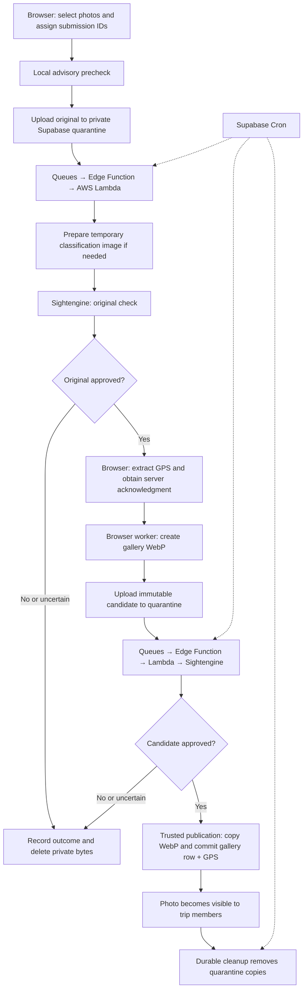

# Update ADR 0002: services and upload flow

Date: 2026-09-30

Status: Planned; ADR amendment and implementation pending.

## Summary

Update [ADR 0002](../docs/adr/0002-photo-upload-pipeline.md) with the finalized decisions, an explicit services table, and an end-to-end flow diagram. Preserve its original date and change its status to **Accepted design; implementation and deployment pending**.

This plan covers the ADR amendment. Application implementation follows after the amended ADR is reviewed.

## Services and responsibilities

Add this table near the beginning of the ADR:

| Service/runtime | Responsibility |
|---|---|
| Browser workers | Local advisory precheck, GPS extraction, and optimization of approved sources into gallery WebP images |
| Supabase Auth and RLS | Authenticate uploaders and enforce trip membership, quarantine isolation, and recovery access |
| Supabase Storage | Hold immutable originals and candidates in a private quarantine bucket and published WebP images in `trip-photos` |
| Supabase Postgres | Store submission identity, GPS, stage and outcome, retry state, capacity reservations, and gallery metadata |
| Supabase Queues | Deliver durable moderation, publication, and cleanup jobs |
| Supabase Cron | Recover interrupted work, dispatch retries, enforce expiry, and sweep late objects |
| Supabase Edge Functions | Authorize operations, orchestrate jobs, invoke Lambda, and finalize publication |
| AWS Lambda | Read authorized stored images, prepare temporary classification images when required, and call Sightengine |
| Sightengine | Authoritative original and candidate classification using `nudity-2.1` |

State explicitly that **AWS Lambda is the selected AWS service**. Lambda prepares a temporary classification JPEG only when provider compatibility or input limits require it, and discards it after checking. Browser workers produce the published WebP.

## End-to-end flow

Add the following diagram:

Explain these flow boundaries alongside the diagram:

- Technical failures retry or pause; they never authorize publication.
- The local precheck is advisory. Only the server verdict can approve or permanently reject a submission.
- Browser optimization requires an open browser. Once the candidate has transferred, final verification and publication can finish while the browser is closed.
- Gallery visibility requires committed gallery metadata and current trip membership, including when a copied Storage object exists before the metadata transaction commits.
- Cancellation and publication serialize against the same submission. Publication rechecks current access and expiry.
- The submission ID remains stable. Regenerated candidates use new immutable generations; retired generations cannot publish.

## Incorporate finalized decisions

Replace the ADR's stale open-question wording with these decisions:

### Moderation and runtime

- Use Sightengine's free plan and an IAM-authorized AWS Lambda invoked only by trusted server code. Pause on quota exhaustion; do not automatically upgrade to paid usage.
- Use `nudity-2.1` with conservative thresholds for the selected prohibited-content scores: below `0.20` approves, `0.20–0.80` is uncertain and rejects, and `0.80` or above rejects as detected prohibited content. Ordinary clothed and swimwear photos remain allowed.
- Use lazy-loaded NSFWJS for an advisory local precheck. Provider failures remain technical failures, separate from content rejection.
- Bind authoritative checks to the actual immutable stored bytes. Prepare a temporary metadata-free classification JPEG for HEIC or oversized provider inputs; never publish that temporary image.

### Browser processing and capacity

- Accept supported still JPEG, PNG, WebP, and HEIC inputs up to 20 MiB and 50 megapixels. Reject animation and multi-photo HEIC inputs; auxiliary thumbnails and depth images do not count as additional photos.
- Produce WebP at a maximum 2,560-pixel long edge and quality `0.8`, preserving orientation and aspect ratio without upscaling.
- Use two processing workers and three upload slots on desktop/tablet; use one processing worker and two upload slots on phones.
- Bound candidate buffers, including active transfers and retry-held candidates, to three candidates/24 MiB on desktop/tablet and two candidates/16 MiB on phones. Reserve space before processing and cap each candidate at 8 MiB.
- Keep one scheduler per signed-in user across tabs using Web Locks and BroadcastChannel. Persist submission metadata in IndexedDB, without local image bytes.
- Reserve Storage capacity for the candidate and publication copy before admitting the original. Use a default 800 MiB project budget that accounts for stored objects and outstanding reservations; pause admission when capacity is unavailable.

### Recovery and retries

- Allow authorized recovery of an approved original only for its uploader with current trip membership.
- If the original never reached the server, require per-photo reselection matched to the existing submission's source fingerprint and byte size.
- Apply four automatic retries after the initial attempt separately to each retryable stage. Use delays of 2, 4, 8, and 16 seconds plus 0–1 second of jitter; respect longer server-requested delays.
- Release worker slots during retry delays. Pause offline, reconcile server state when connectivity returns, and resume automatically.
- Use Supabase Queues for durable jobs and Cron for recovery and dispatch. Reconcile uncertain transfer and publication outcomes before retrying, preserving submission identity and preventing duplicate gallery entries.

### Retention, cleanup, and publication

- Expire unresolved submissions seven days after creation; the expiry does not slide with activity.
- Delete rejected and canceled image bytes promptly. Keep them inaccessible while cleanup retries.
- After cleanup exhausts its automatic retries, retain discoverable cleanup work and start a new retry cycle daily; also support an explicit operator retry.
- Retain permanent minimal submission tombstones for notification, idempotency, and denying late uploads or stale publication. Scrub filename, source fingerprint, submission GPS, and detailed provider data after cleanup. Published GPS remains in gallery metadata.
- Sweep late objects so an upload authorized before cancellation cannot leave a recreated quarantine object behind. Terminal submissions remain unable to publish.
- Commit publication metadata idempotently under the submission ID and queue cleanup durably. A failed cleanup does not remove an otherwise successfully published photo.
- Grandfather existing gallery photos; do not retroactively moderate them.

### User experience

- Keep the account-scoped upload manager above authenticated page routes so navigation preserves work.
- Show stage-based per-photo progress and accessible queue controls across routes, including retry, cancellation, awaiting moderation, recovery, and capacity-paused states.
- Stop browser work and clear account-scoped browser state on sign-out. Trusted server jobs continue when their prerequisites are available.

## Replace remaining design work

Replace **Remaining design work** with **Implementation validation**. The remaining work verifies the accepted design rather than reopening the architecture:

- Confirm provider-account quotas, eligible endpoints, and AWS configuration before deployment.
- Verify original HEIC compatibility and final WebP verification against provider input limits.
- Measure classification quality on representative travel photos and validate the selected score fields and thresholds.
- Validate image quality, memory bounds, and worker concurrency on the group's phones, tablets, and desktops.
- Test recovery, membership revocation, immutable generations, cancellation/publication races, late uploads, quota pauses, expiry, and partial cleanup.

## Validation of the ADR amendment

- Review the entire ADR for contradictions between browser optimization and Lambda classification preparation.
- Remove statements that still describe the selected provider, queues, recovery, limits, retries, or retention as undecided.
- Verify that the services table and diagram agree with the detailed flow and access controls.
- Add primary-source references for the selected services and browser coordination APIs.
- Keep the amendment scoped to the ADR. Application tests are unnecessary for this documentation-only change.

## Reference material

- [Sightengine pricing](https://sightengine.com/pricing)
- [Sightengine nudity detection model 2.1](https://www-cf.sightengine.com/docs/advanced-nudity-detection-model-2.1)
- [Sightengine supported image types](https://sightengine.com/faq/supported-image-types)
- [Sightengine image limits](https://sightengine.com/faq/acceptable-recommended-image-dimensions)
- [Sightengine data retention](https://sightengine.com/faq/data-retention-after-processing)
- [AWS Lambda pricing](https://aws.amazon.com/lambda/pricing/)
- [AWS Lambda reserved concurrency](https://docs.aws.amazon.com/lambda/latest/dg/configuration-concurrency.html)
- [Supabase Queues](https://supabase.com/docs/guides/queues/quickstart)
- [Consuming queues with Edge Functions](https://supabase.com/docs/guides/queues/consuming-messages-with-edge-functions)
- [Scheduling Edge Functions](https://supabase.com/docs/guides/functions/schedule-functions)
- [Supabase Edge Function limits](https://supabase.com/docs/guides/functions/limits)
- [Web Locks API](https://developer.mozilla.org/en-US/docs/Web/API/Web_Locks_API)
- [BroadcastChannel API](https://developer.mozilla.org/en-US/docs/Web/API/Broadcast_Channel_API)
